<h1 align="center"> TryHackMe OverPass - Writeup</h1>

 

Its me **m3rcer** back with another one .
This is a fun little box which is quite easy . Only the inital foothold requires you to think out of the box the rest is using standard pentesting techniques. 

*[Find the link to Overpass on TryHackMe's Official site here!](https://tryhackme.com/room/overpass)*

Lets Begin!

----------------------------------------------------------------------------------------------------

### ENUMERATION

We kick it off w a usual nmap scan . In this case a default script and version scan w the verbose flag to see open ports on the fly without having to wait for the scan to finish.

`sudo nmap -sC -sV 10.10.x.x -v`

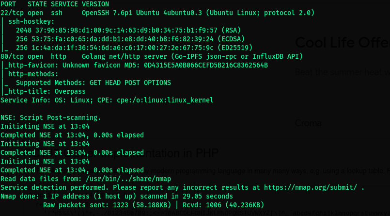

We start off by checking port 80:

We check the source and nothing too interesting is found here. 
Looking at the about us page we have a potential list of users which we add to our **users.list** file .

Next we use gobuster to perform basic directory bruteforcing .

`gobuster dir -u http://10.10.48.29 -w /usr/share/wordlists/dirbuster/directory-list-2.3-medium.txt -t 70 -o gobuster_main.out -x html`

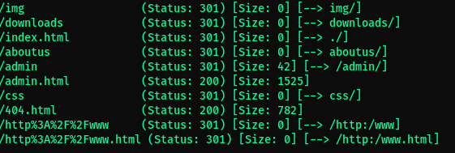

We found a the admin login panel from here at **/admin**

Trying default credentials like __administrator:password__ and so on resulted in invalid credentials .

Maybe a possible sql injection ? 

I intercepted the login request using burp and saved the request. 
I fed this request into sqlmap using the following query :

`sqlmap -r request.txt --risk 3 --level 5 --batch --dbms=mysql`

Nothing seems to be found or seems to be vulnerable . I ran nikto too using `nikto -h 10.10.x.x` and it too resulted in nothing .

Moving to look for something unique. 

Looking at the admin login page source we see -->

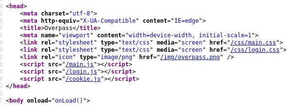 

It hints to login.js . Looking at login.js to see for default creds or some vulns we find a vulnerable set of code... 

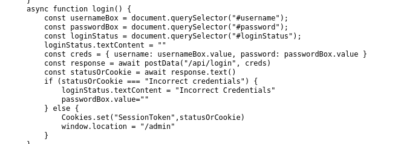 

In the given funtion the code says that if the server responds w "Incorrect Credentials" dont allow access to the admin panel .

Hmm... All we have to do is change the response to something other than "Incorrect Credentials" to access the login panel?

----------------------------------------------------------------------------------------------------

## FOOTHOLD

Follow these steps:

- Switch over to burp , in the proxy options check the checkbox for intercept server responses . And turn intercept on.

- Head back to the admin panel and enter **administrator:password**.

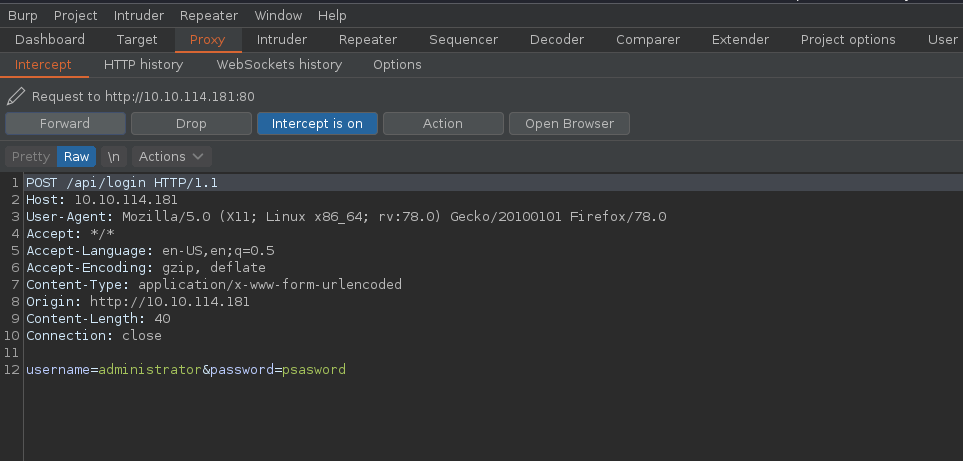 

- Switch back to burp and forward the request.

- Now change the server response to match my response . Basically we remove the inccorect credentials part which casues login.js to execute the else part of the code which is a succesfull login . Changing the status code from 200 to 301/302 to redirect us back to the admin page.

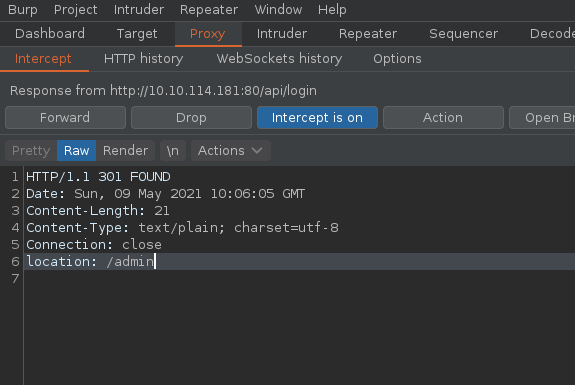 

- Turn intercept off.

- And like magic we've logged in !

 

Next we see we find an encrypted key w a hint that its crackable w a wordlist. And that it belongs to james.

We next use ssh2john to convert it into a format that can be cracked by john .

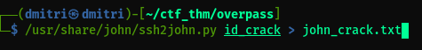 

Next we crack it using :

`john --wordlist=/usr/share/wordlists/rockyout.txt john_crack.txt`

And just like that we have james's creds!

We login using ssh and finally retrieve the user.txt file!

Congrats! 

----------------------------------------------------------------------------------------------------

## PRIVESC

We run linpeas on the server to further enumerate..

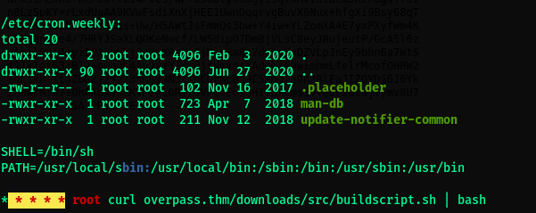

We notice that the contents of crontab has a script run by root every minute to curl the contents of buildscript.sh. 

Hmm how could this be exploited ? What if we could alter the hosts content to point to our mailicious server which would serve a malicious "buildscript.sh" . 

Checking if the hosts file is writable we find it is ! Bingo!

- We start by setting up the directory structure as seen in the crontab in our local machine.

- We create the buildscipt.sh in the respective directory. Only we change the contents of buildscript.sh to give us a reverse shell.

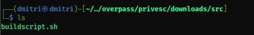 

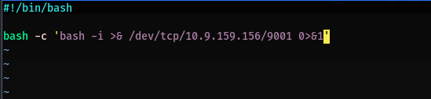 

- Go back up the dir structure and start your python webserver.

- Next open up the __/etc/hosts__ in the victim machine and add an entry to point overpass.htb to your ip.

Save the file 

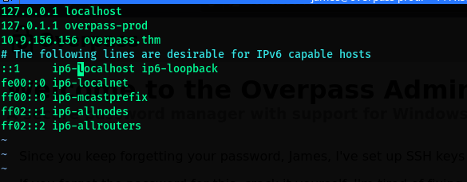 

- Finally setup your nc listener as set in your script.

- Wait for a minute and get a root shell!!!

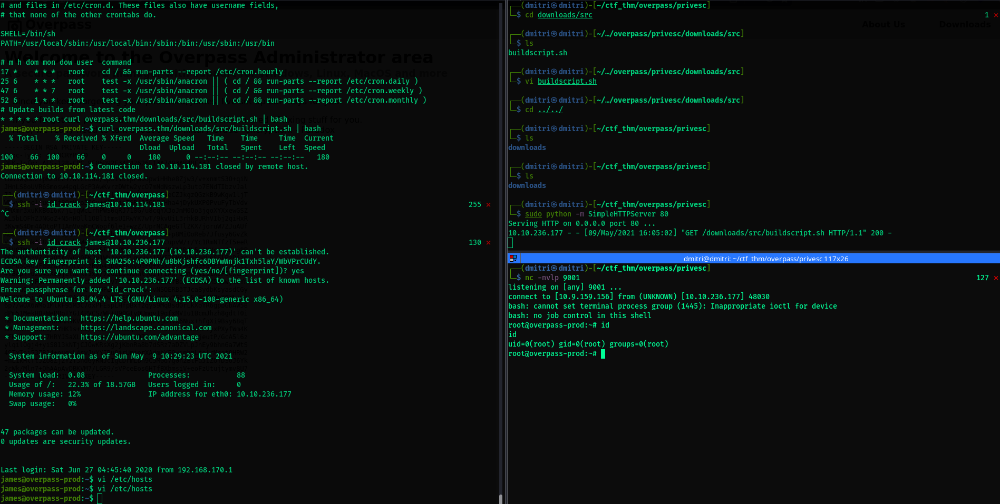 

Now retrieve your root.txt and pwn this box!

Congrats that was fun now wasn't it!

### Bookmark my page to get the latest ctf writeups on the regular!

