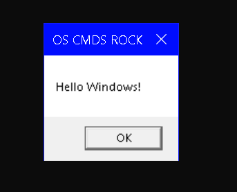

## This Program demonstrates the use of native OS libraries like user32.dll and libc to execute OS commands.

- C# can interact with native libraries like user32.dll(windows) and libc(NIX) using the P/Invoke call. 

- Attributes (DllImport) allow you to add extra information to methods that is used at runtime by Mono/.Net instead of expecting us to write it.

- We use "os.Platform" to enumerate the respective Platform ID's to determine the OS and run commands accordingly.

- This program is platform independent !

### Code:


```Csharp
using System;
using System.Runtime.InteropServices;

namespace pinvoke_yeah
{


        class MainClass
        {
                [ DllImport("user32", CharSet=CharSet.Auto)]
                        static extern int MessageBox(IntPtr hWnd, String text, String caption, int options);


                 [ DllImport("libc")]
                         static extern int printf(string message);


                 static void Main(string[] args)
                 {
                         OperatingSystem os = Environment.OSVersion;

                         if (os.Platform == PlatformID.Win32Windows||os.Platform == PlatformID.Win32NT)
                         {
                                 MessageBox(IntPtr.Zero, "Hello Windows!", "OS CMDS ROCK", 0);
                         }
                         else
                         {
                                 printf("Hello NIX!");
                         }

                 }
        }

}

```

### Output:

*Windows -->*



*Linux -->*


