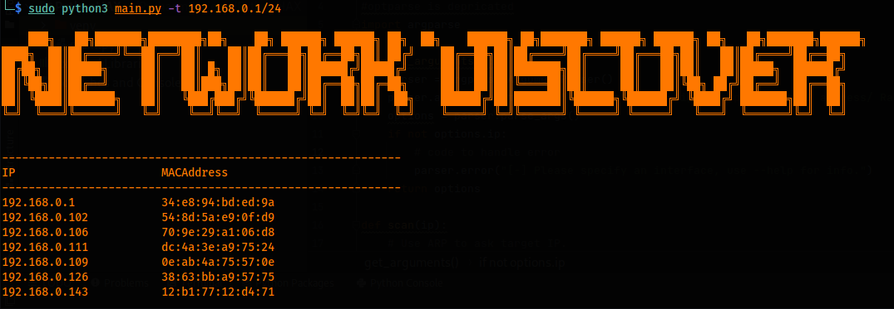

<p align="left">
 
</p>


## This is a python script that discovers all hosts online on the network using the scapy module by manually crafting and parsing the responses.

- We implement argarse instead of the optparse module as optparse is deprecated and they are identical in usage.

- Use of the scapy module to craft packets with a custom ether, arp part.

- Iterating over nested data structures (in this case a nested dict in a list).

- Use show(), summary() methods to view and debug crafted scapy packets. 

### Code:

```python
#!/usr/bin/env python

import scapy.all as scapy
#optparse is depricated
import argparse

def get_arguments():
    parser = argparse.ArgumentParser()
    parser.add_argument("-t", "--target", dest="ip", help="Target IP address/ Range to scan")
    options = parser.parse_args()
    if not options.ip:
        # code to handle error
        parser.error("[-] Please specify an interface, use --help for info.")
    return options

def scan(ip):
    # Use ARP to ask target IP.
    arp_request = scapy.ARP(pdst=ip)
    # Set destination MAC to broadcast MAC.
    broadcast = scapy.Ether(dst="ff:ff:ff:ff:ff:ff")
    # Combining broadcast and arp_request as a single packet.
    arp_request_broadcast = broadcast/arp_request
    # Send and recieve response with custom ether/arp part
    answered_list = scapy.srp(arp_request_broadcast, timeout=1, verbose=False)[0]
    clients_list = []
    for element in answered_list:
        # use show method to view packet contents.
        client_dict = {"ip": element[1].psrc, "mac": element[1].hwsrc}
        clients_list.append(client_dict)
    return clients_list


def print_result(results_list):
    print("""
    ███╗   ██╗███████╗████████╗██╗    ██╗ ██████╗ ██████╗ ██╗  ██╗    ██████╗ ██╗███████╗ ██████╗ ██████╗ ██╗   ██╗███████╗██████╗ 
████╗  ██║██╔════╝╚══██╔══╝██║    ██║██╔═══██╗██╔══██╗██║ ██╔╝    ██╔══██╗██║██╔════╝██╔════╝██╔═══██╗██║   ██║██╔════╝██╔══██╗
██╔██╗ ██║█████╗     ██║   ██║ █╗ ██║██║   ██║██████╔╝█████╔╝     ██║  ██║██║███████╗██║     ██║   ██║██║   ██║█████╗  ██████╔╝
██║╚██╗██║██╔══╝     ██║   ██║███╗██║██║   ██║██╔══██╗██╔═██╗     ██║  ██║██║╚════██║██║     ██║   ██║╚██╗ ██╔╝██╔══╝  ██╔══██╗
██║ ╚████║███████╗   ██║   ╚███╔███╔╝╚██████╔╝██║  ██║██║  ██╗    ██████╔╝██║███████║╚██████╗╚██████╔╝ ╚████╔╝ ███████╗██║  ██║
╚═╝  ╚═══╝╚══════╝   ╚═╝    ╚══╝╚══╝  ╚═════╝ ╚═╝  ╚═╝╚═╝  ╚═╝    ╚═════╝ ╚═╝╚══════╝ ╚═════╝ ╚═════╝   ╚═══╝  ╚══════╝╚═╝  ╚═╝
                                                                                                                               
    """)
    print("------------------------------------------------------------\nIP\t\t\tMACAddress\n------------------------------------------------------------")
    for client in results_list:
        print(client["ip"] + "\t\t" + client["mac"])

options = get_arguments()
scan_result = scan(options.ip)
print_result(scan_result)


```


### Output:


