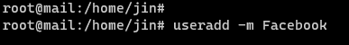
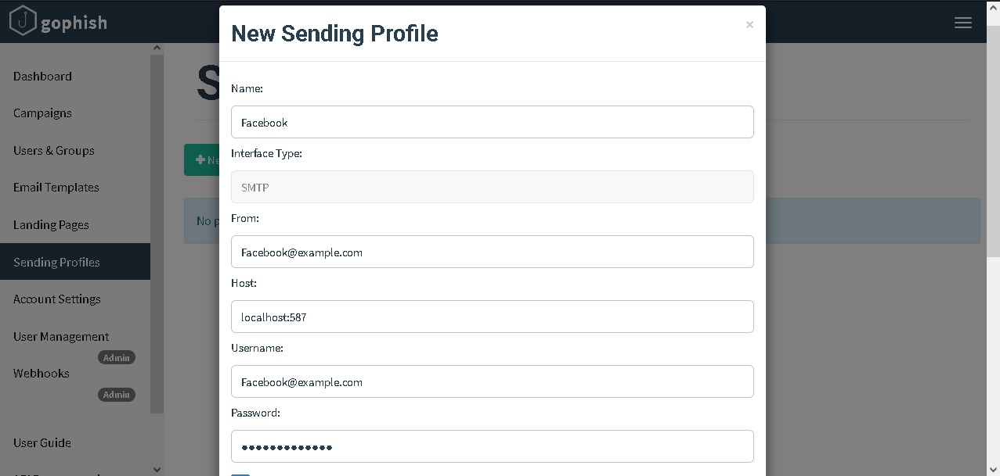
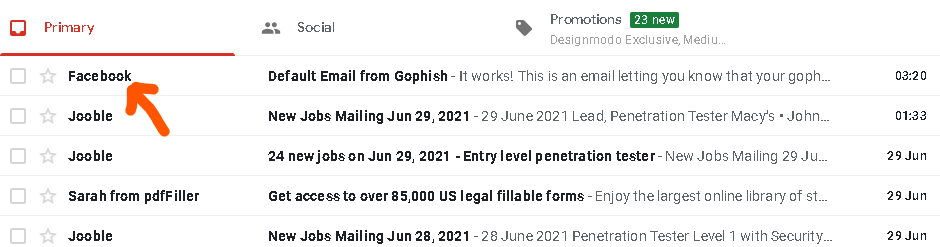
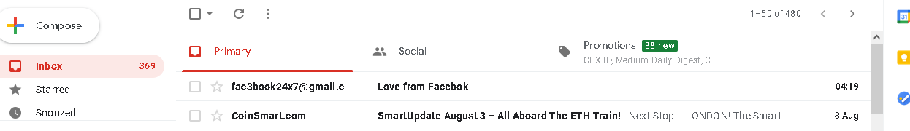

<h1 align="center">Spoofing and Evasion</h1> 

<p align="center">
     
</p>

_________________________________________________________________________________________________


## Spoofing

**1. Spoofing: A Locally built SMTP server.**

 _Let's say we want to impersonate Facebook/Instagram._ 

 All you have to do once the local SMTP is up an running as discussed [previously](https://github.com/m3rcer/Red-Team-SMTP-Spam-Filter-Bypass/blob/main/local_smtp.md) is -

  > _(Optional):_ Create a user account on your vps server in accordance to your spoofed account if you want to add the functionality to recieve emails too. 
  
   


  > Setup a "New Sending Profile" on GoPhish or a Phish server of choice as follows:

   


  > Fire-Away using the New Profile.


 


**2. Spoofing: A Cloud Provided Relay.**

To spoof all you need to do is register a username in accordance with your spoofed target . 

For example registering in the case of "Facebook@gmail.com". Im sure this mail would be taken in GMail. Find a cloud provider other than GMail, like Mailjet, Mailgun, Sendgrid and other providers until that target host to spoof is not registered/taken for that provider. In short maybe you could spoof facebook on a less popular SMTP provider like Mailgun if nobody has registered with the username of "Facebook". You could have that mail name then.
The best you could do if your using a popular cloud provider like gmail is make an account that resembles "Facebook" as close as possible like "fac3book24x7@gmail.com". That's the closest to Facebook i could find on a popular cloud SMTP provider like gmail. 
Maybe your 75 year old pop's would fall for such spoofing strats in today's growing security minded youth. 

So finding a provider in accordance to your campaign and finding the balance in deliverability is hard as not all providers provide A+ delivery to land through the spam folder and not all provide mail names that are available to abuse alongside your chosen campaigns espesicially the popular ones like Facebook.

The header spoofing feature as detailed in the image for the local SMTP is not possible here as we do not completely control the SMTP to do this. 




**3. Spoofing: An Open Relay.**

This basically depends on you [pentesting](https://book.hacktricks.xyz/pentesting/pentesting-SMTP) the open relay , finding some sort of creds/misconfigs to take advantage of , enumerate possible usernames and abuse trust relationships.


__________________________________________________________________________________________________

## Evasion

**1. Evasion: A Locally built SMTP server.**


_Remove sensitive information from email headers with postfix -->_

To get started, make a small file with regular expressions in /etc/postfix/header_checks:


```bash
/^Received:.*with ESMTPSA/              IGNORE
/^X-Originating-IP:/    IGNORE
/^X-Mailer:/            IGNORE
/^Mime-Version:/        IGNORE
```

The “ESMTPSA” match works for me because I only send email via port 465. I don’t allow SASL authentication via port 25. You may need to adjust the regular expression if you accept SASL authentication via SMTP.


Now, add the following two lines to your /etc/postfix/main.cf:

```bash
mime_header_checks = regexp:/etc/postfix/header_checks
header_checks = regexp:/etc/postfix/header_checks
```

Rebuild the hash table and reload the postfix configuration:


```bash
postmap /etc/postfix/header_checks
postfix reload
```

Now, send a test email. View the headers and you should see the original received header (with your client IP address) removed, along with details about your mail client.


**2. Evasion: A Cloud Provided Relay.**

_(Optional: If anonymity is priority)_ This is pretty simple. When connecting to any cloud provided Management Interface for your SMTP provided relay always do so through anonymity using a method of choice like a VPN / sock5 proxy etc as IP's are logged . Use Crypto support to remain anonymous if they provide such options. 

**3. Evasion: An Open Relay.**

_(Optional: If anonymity is priority)_ Same applies as above. When connecting to an open relay  always do so through anonymity using a method of choice like a VPN / sock5 proxy and then pentest the server or perform your actions.


_________________________________________________________________________________________________
